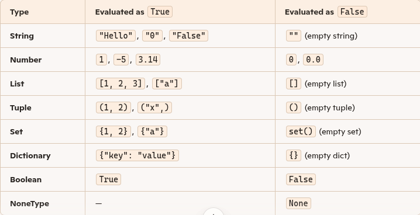

## Booleans represent one of two values: True or False.
### Print a message based on whether the condition is True or False:

```python
a = 200
b = 33

if b > a:
  print("b is greater than a")
else:
  print("b is not greater than a")
  ```

## Evaluate Values and Variables
- The bool() function allows you to evaluate any value, and give you True or False in return,

```python
x = "Hello"
y = 15

print(bool(x))
print(bool(y))
```
---

## Most Values are True
- In Python, values are not just True or False by type; instead, they are evaluated for truthiness when used in conditions (like if statements).
- General Rule : Most values are considered True if they contain something (non-empty, non-zero).
- Empty or zero values are considered False.

## How Python Decides
- When you use a value in a conditional, Python internally calls the object’s __bool__() or __len__() method:
- If __bool__() returns True, the object is truthy.
- If __len__() returns 0, the object is falsy.

## Examples by Type


## Python operators are special symbols that let you perform operations on values and variables. They cover arithmetic, assignment, comparison, logical, bitwise, membership, and identity operations

## 1. Arithmetic Operators

```python
+ Addition       5 + 2 = 7
- Subtraction    10 - 3 = 7
* Multiplication 4 * 2 = 8
/ Division       7 / 2 = 3.5
// Floor division 7 // 2 = 3
% Modulus         7 % 2 = 1
** Exponentiation 2 ** 3 = 8
``` 
## 2. Assignment Operators

```python
 = Simple assignment   x = 5
+= Add and assign      x += 3 (same as x = x + 3)
-= Subtract and assign x -= 2
*= Multiply and assign x *= 4
/= Divide and assign   x /= 2
```
## 3. Comparison Operators
- Used to compare values; return True or False
## 4. Logical Operators
- Used to combine conditional statements.
**and** True if both are True
**or**  True if at least one is True
**not** Negates the condition

## 5. Bitwise Operators
- Operate at the binary level.
```python
& AND           5 & 3 = 1
| OR            5 | 3 = 7
^ XOR           5 ^ 3 = 6
~ NOT          ~5 = -6
<< Left shift   5 << 1 = 10
>> Right shift  5 >> 1 = 2
```
## 6. Membership Operators
- Check for membership in sequences.
```python
in  "a" in "apple"  True
not in  "z" not in "apple"  True
```
## 7. Identity Operators
- Check if two objects share the same memory location.
```python   
is x is y
is not x is not y
```
